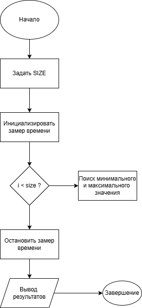
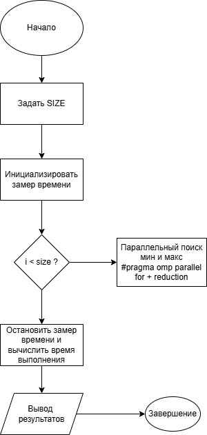

# Assignment 1 — Heterogeneous Parallelization
## Описание

В данном репозитории представлено выполнение Assignment 1 по дисциплине
«Heterogeneous Parallelization».

Цель работы изучение основ языка C++, работы с динамической памятью,k
последовательных алгоритмов и параллельного программирования с использованием OpenMP.


#### Задание 1 (25 баллов)

Реализована программа на C++, которая:

* динамически выделяет массив из 50 000 целых чисел
* заполняет массив случайными значениями в диапазоне от 1 до 100
* вычисляет среднее значение элементов массива
* корректно освобождает выделенную память

<p align="center">
  
</p>

Файл: task1.cpp
Результат:
```html
Average value: 50.1896
```
#### Задание 2 (25 баллов)

Реализована программа, которая:

* создаёт массив из 1 000 000 целых чисел
* выполняет последовательный алгоритм поиска минимального и максимального элементов
* измеряет время выполнения алгоритма

<p align="center">
  
</p>

Файл: task2.cpp
Результат:
```html
Massive size: 1000000
Minimal value: 11
Maximum value: 9999991
Time for algorithm: 1 ms
```
#### Задание 3 (25 баллов)

Реализована программа, которая:

* использует OpenMP для параллельного поиска минимального и максимального элементов
* работает с массивом из задания 2
* позволяет сравнить время выполнения последовательной и параллельной реализаций
<p align="center">
  
</p>

Файл: task3.cpp
Результат: 
```html
Array size: 1000000
Minimum value: 2
Maximum value: 9999998
Execution time(OpenMP): 1 ms
```
#### Задание 4 (25 баллов)

Реализована программа, которая:

* создаёт массив из 5 000 000 целых чисел
* вычисляет среднее значение элементов массива последовательным способом
* вычисляет среднее значение с использованием OpenMP и механизма reduction
* сравнивает время выполнения обеих реализаций

<p align="center">
  
</p>

Файл: task4.cpp
Результат:
```html
Array size: 5000000
Sequential average: 50.4764, time: 8 ms
Parallel average (OpenMP): 50.4764, time: 3 ms
```

#### Примеры компиляции
```html
g++ task1_dynamic_array.cpp -o task1
g++ task2_seq_min_max.cpp -o task2
g++ -fopenmp task3_omp_min_max.cpp -o task3
g++ -fopenmp task4_avg_seq_vs_omp.cpp -o task4
```

#### Контрольные вопросы

##### 1. В чём отличие динамического массива от статического массива в языке C++?
Статический массив имеет фиксированный размер и создаётся заранее.
Динамический массив создаётся во время работы программы, и его размер можно задать самому.
##### 2. Что такое указатель и зачем он используется при работе с динамической памятью?
Указатель это переменная, которая хранит адрес в памяти.
Он нужен, чтобы работать с динамической памятью.

##### 3. Почему важно корректно освобождать память после использования динамических массивов?
Если не освобождать память, она будет «утекать» — программа начнёт потреблять всё больше памяти и может зависнуть или упасть.

##### 4. В чём разница между последовательной и параллельной обработкой массива?
Последовательная обработка — массив обрабатывается одним потоком, по очереди.
Параллельная — несколько потоков работают одновременно, каждый со своей частью массива.

##### 5. Что делает директива #pragma omp parallel for?
```html
#pragma omp parallel for
```
— автоматически делит цикл for между потоками и выполняет его параллельно.

##### 6. Для чего используется механизм reduction в OpenMP?
reduction используется, чтобы безопасно объединить результаты из всех потоков (например, сумму, максимум).

##### 7. Почему при параллельном вычислении суммы необходимо использовать reduction, а не обычную переменную?
Потому что обычная переменная будет меняться сразу из разных потоков, возникнет ошибка.
reduction делает так, чтобы у каждого потока была своя копия, а потом они корректно сложились.

##### 8. Какие факторы могут привести к тому, что параллельная версия программы будет работать медленнее последовательной
Параллельная версия может быть медленнее, если:

- массив маленький (накладные расходы больше пользы);
- слишком много потоков;
- есть синхронизация и блокировки;
- частые обращения к общей памяти.