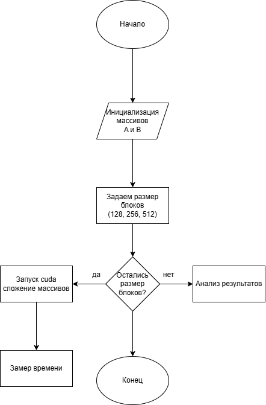
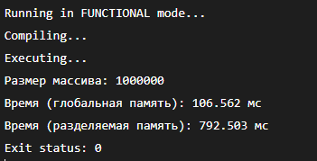
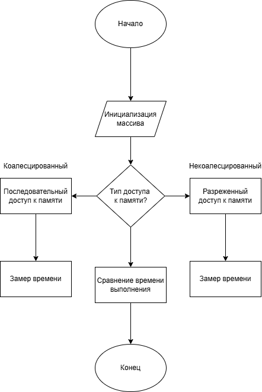
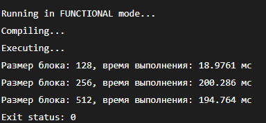
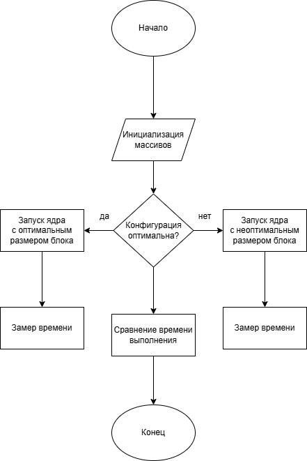
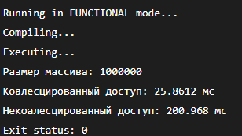
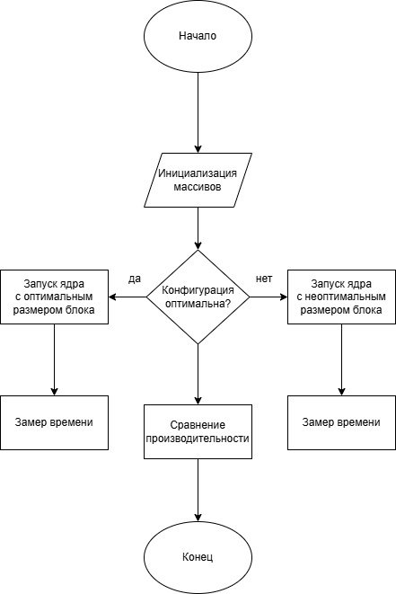
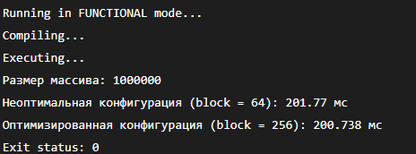

# Assignment 3  
## Архитектура GPU и оптимизация CUDA-программ

Данный репозиторий содержит решения для **Assignment 3**, посвящённого изучению архитектуры GPU и основ оптимизации CUDA-программ.  
В рамках работы были реализованы и проанализированы несколько CUDA-программ, демонстрирующих влияние различных факторов на производительность вычислений на GPU.

---

## 📁 Структура проекта


---

## 🧪 Задание 1 (25 баллов)  
### Поэлементная обработка массива

Реализована CUDA-программа для поэлементного умножения элементов массива на заданное число.  
Были реализованы **две версии программы**:

1. с использованием **только глобальной памяти**;
2. с использованием **разделяемой (shared) памяти**.

Для массива размером **1 000 000 элементов** проведено сравнение времени выполнения обеих реализаций.

**Блок-схема**
<p align="center">
  
</p>

**Файл:** `Задание_1.cu`
**Компиляция и запуск** 
```bash
nvcc Задание_1.cu -o task1
./task1
```
**Результат**
<p align="center">
  
</p>

---

## 🧪 Задание 2 (25 баллов)  
### Влияние размера блока потоков на производительность

Реализована CUDA-программа для **поэлементного сложения двух массивов**.  
Проведено исследование влияния **размера блока потоков** на производительность программы.

Замеры времени выполнены как минимум для **трёх различных размеров блока**:
- 128 потоков
- 256 потоков
- 512 потоков

**Блок-схема**
<p align="center">
  
</p>

**Файл:** `Задание_2.cu`
**Компиляция и запуск** 
```bash
nvcc Задание_2.cu -o task1
./task1
```
**Результат**
<p align="center">
  
</p>

---

## 🧪 Задание 3 (25 баллов)  
### Коалесцированный и некоалесцированный доступ к памяти

Реализована CUDA-программа для обработки массива, демонстрирующая:

- **коалесцированный доступ** к глобальной памяти;
- **некоалесцированный доступ** к глобальной памяти.

Для массива размером **1 000 000 элементов** выполнено сравнение времени работы обеих реализаций.

**Блок-схема**
<p align="center">
  
</p>

**Файл:** `Задание_3.cu`
**Компиляция и запуск** 
```bash
nvcc Задание_3.cu -o task1
./task1
```
**Результат**
<p align="center">
  
</p>

---

## 🧪 Задание 4 (25 баллов)  
### Оптимизация конфигурации сетки и блоков потоков

Для одной из ранее реализованных программ была выполнена настройка параметров:
- размера блока потоков;
- конфигурации сетки.

Проведено сравнение производительности **неоптимальной** и **оптимизированной** конфигураций.

**Блок-схема**
<p align="center">
  
</p>

**Файл:** `Задание_4.cu`
**Компиляция и запуск** 
```bash
nvcc Задание_4.cu -o task1
./task1
```
**Результат**
<p align="center">
  
</p>

---

## Контрольные вопросы
**1. Какие основные типы памяти существуют в архитектуре CUDA и чем они отличаются по скорости доступа?**
Основные типы памяти: глобальная, разделяемая, регистры, локальная и константная память.
Самый быстрый доступ обеспечивают регистры и разделяемая память, самый медленный — глобальная память.

**2. В каких случаях использование разделяемой памяти позволяет ускорить выполнение CUDA-программы?**

Разделяемая память эффективна, когда несколько потоков одного блока многократно используют одни и те же данные.

**3. Как шаблон доступа к глобальной памяти влияет на производительность GPU-программы?**

Коалесцированный доступ позволяет объединять обращения потоков в одну транзакцию памяти, что существенно повышает производительность.

**4. Почему одинаковый алгоритм на GPU может показывать разное время выполнения при разных способах обращения к памяти?**

Из-за различий в количестве и эффективности транзакций памяти, а также из-за кэширования и латентности доступа.

**5. Как размер блока потоков влияет на производительность CUDA-ядра?**

Размер блока влияет на загрузку вычислительных блоков GPU, количество активных варпов и эффективность скрытия задержек памяти.

**6. Что такое варп и почему важно учитывать его при разработке CUDA-программ?**

Варп — это группа из 32 потоков, выполняющихся синхронно. Неэффективное использование варпов может приводить к снижению производительности.

**7. Какие факторы необходимо учитывать при выборе конфигурации сетки и блоков потоков?**

Необходимо учитывать архитектуру GPU, количество регистров, использование разделяемой памяти и характер вычислений.

**8. Почему оптимизация CUDA-программы часто начинается с анализа работы с памятью, а не с изменения алгоритма?**

Потому что операции доступа к памяти часто являются узким местом, и их оптимизация может дать значительный прирост производительности без изменения алгоритма.