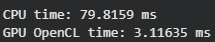

# Practice 6 — OpenCL

## Описание работы

Целью данной практической работы является изучение базовых принципов программирования с использованием технологии OpenCL, а также освоение методов параллельных вычислений на центральном и графическом процессорах. В рамках работы необходимо было реализовать два вычислительных задания, сравнить время их выполнения на CPU и GPU и проанализировать полученный прирост производительности. Основная идея работы заключается в демонстрации того, что параллельные вычисления позволяют существенно повысить скорость обработки больших массивов данных по сравнению с последовательными алгоритмами.

---

## Задание 1: Сложение двух массивов

В первом задании требовалось реализовать операцию поэлементного сложения двух массивов с применением OpenCL. Были сформированы два массива одинакового размера, заполненные случайными значениями.  

На первом этапе сложение выполнялось последовательно на CPU. Затем аналогичная операция была реализована на GPU с использованием OpenCL-ядра. Программа осуществляла инициализацию платформы и устройства OpenCL, создание контекста и очереди команд, компиляцию ядра, передачу данных на устройство и запуск параллельных вычислений.

### Результаты

В результате эксперимента было получено время выполнения операции на CPU и GPU. Графический процессор показал значительно более высокую производительность по сравнению с центральным процессором, при этом результаты вычислений полностью совпали. Это свидетельствует о том, что даже для простой задачи сложения массивов применение GPU обеспечивает заметное ускорение за счёт одновременной обработки большого количества элементов.

### Блок-схема

---

## Задание 2: Параллельное умножение матриц

Во втором задании реализовывалось параллельное умножение матриц размерностей N×M и M×K с использованием OpenCL.  

Сначала была написана последовательная версия алгоритма на CPU с применением вложенных циклов. Затем была разработана версия для GPU, в которой каждый рабочий поток вычислял один элемент результирующей матрицы. Размеры матриц передавались в ядро как параметры, а вычисления выполнялись в двумерной области рабочих элементов.

### Результаты

Полученные результаты показали, что GPU выполняет операцию умножения матриц в несколько раз быстрее, чем CPU. Проверка корректности подтвердила совпадение результатов параллельной и последовательной реализаций. Это демонстрирует эффективность применения OpenCL для ресурсоёмких вычислительных задач, таких как матричные операции.

### Блок-схема

---

## Вывод

В ходе выполнения практической работы были изучены основы использования OpenCL и принципы организации параллельных вычислений на CPU и GPU. Для обоих заданий было установлено, что графический процессор значительно превосходит центральный по скорости выполнения при обработке больших объёмов данных.  

Технология OpenCL позволяет создавать кроссплатформенные приложения и эффективно задействовать вычислительные ресурсы различных устройств. Параллельные вычисления особенно целесообразны для задач, содержащих большое количество однотипных операций, таких как сложение массивов и умножение матриц.

---

## Контрольные вопросы

### Какие основные типы памяти используются в OpenCL?
**Ответ:**  
- **Global** — глобальная память, доступная всем рабочим потокам, относительно медленная.  
- **Local** — локальная память, общая для группы потоков, работает быстрее глобальной.  
- **Private** — приватная память, доступная только одному потоку, очень быстрая.  
- **Constant** — память только для чтения, доступная всем потокам.

### Как настраиваются глобальная и локальная рабочие группы?
**Ответ:**  
- **Global** определяет общее количество рабочих элементов, которые выполняют ядро.  
- **Local** задаёт размер рабочей группы, элементы которой могут совместно использовать локальную память.

### Чем отличается OpenCL от CUDA?
**Ответ:**  
CUDA предназначена исключительно для видеокарт NVIDIA, тогда как OpenCL является кроссплатформенной технологией и может использоваться на устройствах разных производителей, включая CPU и GPU.

### Какие преимущества даёт использование OpenCL?
**Ответ:**  
OpenCL позволяет запускать программы на различных типах устройств, обеспечивает ускорение вычислений за
