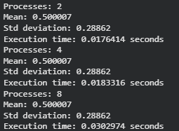
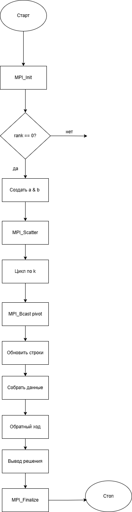
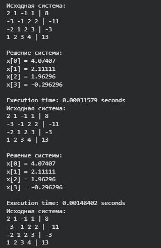
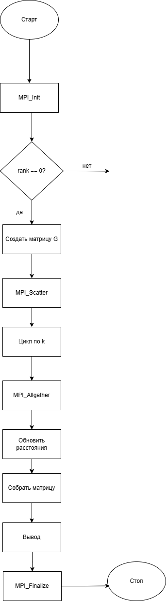

# Практическая работа №9  
## Распределённая обработка данных с использованием MPI

---

## Цель работы

Целью данной практической работы является изучение продвинутых операций MPI и разработка программ для распределённой обработки данных. В рамках работы реализуются параллельные алгоритмы статистического анализа, решения системы линейных уравнений и поиска кратчайших путей в графе, а также проводится анализ производительности и масштабируемости.

---

## Задачи

1. Реализовать распределённое вычисление среднего значения и стандартного отклонения.  
2. Реализовать распределённое решение системы линейных уравнений методом Гаусса.  
3. Реализовать параллельный поиск кратчайших путей в графе (алгоритм Флойда–Уоршелла).  
4. Исследовать производительность программ при различном количестве процессов.  


---

## Практическая часть

Работа была выполнена в среде **Google Colab** с использованием библиотеки **MPICH**.

### Компиляция и запуск

```bash
mpic++ program.cpp -o program
mpirun --allow-run-as-root --oversubscribe -np 4 ./program
```

### Задание 1
Распределённое вычисление среднего и стандартного отклонения

Процесс с rank = 0 создаёт массив случайных чисел размером N = 10^6.
Массив распределяется между процессами с помощью MPI_Scatterv.
Каждый процесс вычисляет локальную сумму и сумму квадратов.
С помощью MPI_Reduce данные собираются на процессе rank = 0, где вычисляются:

- среднее значение

- стандартное отклонение

- Для измерения времени используется функция MPI_Wtime().

#### Результаты


#### Блок-схема


### Задание 2
Распределённое решение системы линейных уравнений методом Гаусса

Процесс с rank = 0 создаёт матрицу коэффициентов A и вектор правых частей b.
Строки матрицы распределяются между процессами с помощью MPI_Scatter.

На каждом шаге:

- ведущая строка передаётся всем процессам с помощью MPI_Bcast

- каждый процесс обновляет свои строки

- После прямого хода данные собираются с помощью MPI_Gather, и на процессе rank = 0 выполняется обратный ход.

#### Результаты


#### Блок-схема


### Задание 3
Параллельный алгоритм Флойда–Уоршелла

Процесс с rank = 0 создаёт матрицу смежности графа.
Матрица распределяется по строкам между процессами с помощью MPI_Scatter.

На каждой итерации:

- все процессы обмениваются актуальными данными с помощью MPI_Allgather

- каждый процесс обновляет свою часть матрицы

- После завершения алгоритма результаты собираются с помощью MPI_Gather.

#### Результаты


#### Блок-схема


### Выводы

В ходе выполнения практической работы были реализованы три распределённых алгоритма с использованием MPI. Экспериментально подтверждено, что:

- MPI позволяет эффективно распределять вычисления между процессами.

- Коллективные операции существенно упрощают обмен данными.

- Производительность зависит не только от числа процессов, но и от объёма коммуникаций.

- При большом количестве процессов эффективность может снижаться из-за накладных расходов.

- Данная работа демонстрирует основные принципы параллельного программирования с распределённой памятью.

### Контрольные вопросы
#### 1. Как изменяется время выполнения программы при увеличении количества процессов? Почему?

При увеличении количества процессов время выполнения обычно уменьшается за счёт параллельной обработки данных. Однако после определённого порога накладные расходы на передачу сообщений начинают доминировать, и ускорение снижается.

#### 2. Какие факторы могут влиять на производительность программы?

На производительность влияют:

- количество процессов,

- объём передаваемых данных,

- частота коммуникаций,

- архитектура сети,

- балансировка нагрузки между процессами.

#### 3. Как можно оптимизировать передачу данных между процессами?

Можно уменьшить количество сообщений, использовать коллективные операции MPI, объединять данные в крупные блоки и минимизировать синхронизации.

#### 4. Какие ограничения возникают при работе с большими данными?

Основные ограничения связаны с объёмом памяти, пропускной способностью сети и увеличением накладных расходов на передачу данных.